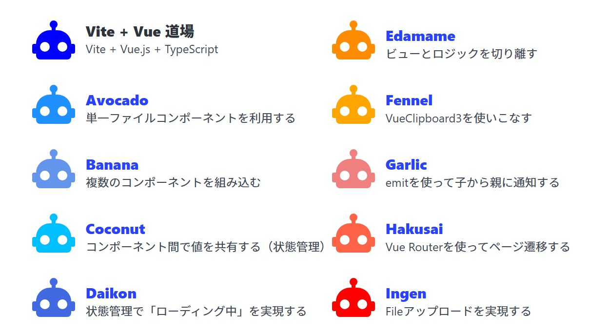

# vite-vue-dojo

Vite + Vue 道場

作成日 2025/03/15、更新日 2025/03/25

## 1. ファイル＆フォルダ構成

```text
--vite-vue-dojo/
    |--.devcontainer/ ... 開発コンテナの設定
    |--app/           ... アプリ本体
    `--docs/          ... つまづいたこと、勉強したことなど
```

## 2. 開発コンテナの選択

[Dev Container Templates](https://github.com/devcontainers/templates) > [Node.js & JavaScript](https://github.com/devcontainers/templates/tree/main/src/javascript-node) > 22-bookworm を選択

VSCode > コマンドプロンプト > Dev Containers: "Add Dev Container Configuration Files ..." の選択肢にある

## 3. アプリの開始

```bash
cd app
npm install
npm run dev
# ブラウザで `http://localhost:5173/`を開く
```


